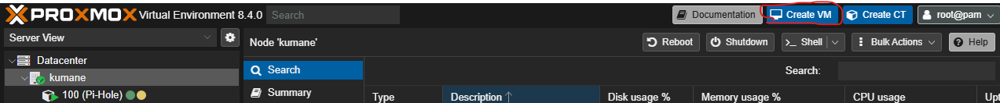
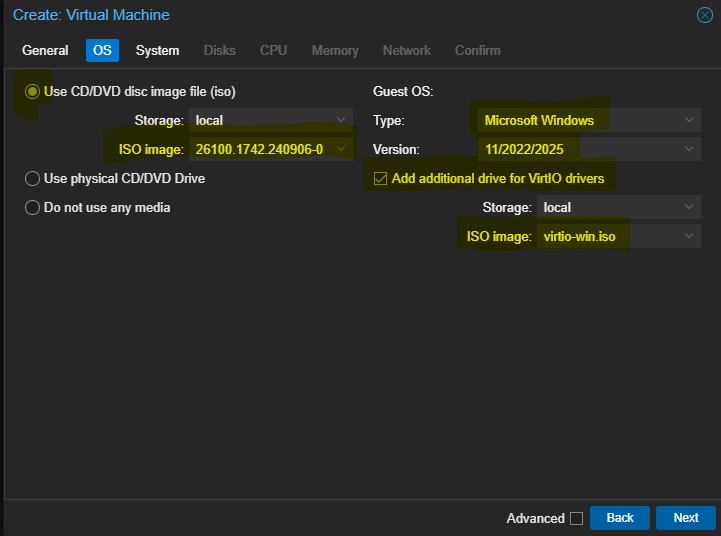
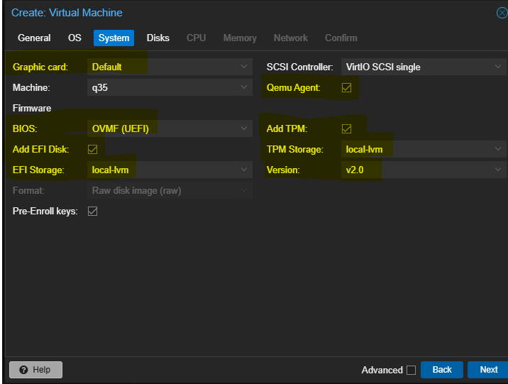
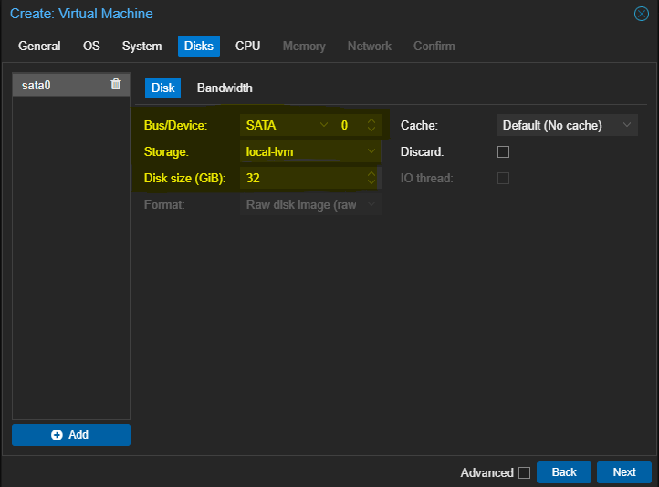

# Creating Windows Server 2025 VM in Proxmox
**Category:** Virtualization, Windows Server  
**Last Updated:** 10/1/2025  
**Author:** Kevin Gonzalez  

---

## 1. Overview
This article demonstrates the process of adding a Windows Server 2025 Virtual Machine to a Proxmox node and installing VirtIO drivers for optimized performance. Upon completion of the procedures, a WS2025 VM will be configured with QEMU-Guest-Agent and SPICE-Guest-Agent.

---

## 2. Prerequisites

- Access to Proxmox Web GUI: (192.168.0.14:8006)  
- Root or Administrative Proxmox Credentials  
- Windows Server 2025 .ISO
- VirtIO Drivers .ISO

---

## 3. Procedure

1. Open Proxmox WebGUI and sign in using appropriate credentials.
2. Under Server View on left-hand side, click to expand *Datacenter* and then click to expand the appropriate *Node* 
3.  Click *Create VM* 
4. Set *VM ID* to chosen # within standard convention, set a name for the VM under *name* and then click Next
5. Select *Use CD/DVD disc image file (iso)*, then select the storage device the Windows Server 2025 .iso is stored on, and select the appropriate .iso
6. Under *Guest OS* on the right-hand side of the OS Tab, change *Type:* to *Microsoft Windows*, *Version* to *11/2022/2025*, and click the box for *Add additional drive for VirtIO drivers*
	 **Failure to add VirtIO drivers will result in significant performance loss due to lack of paravirtualized access to devices and peripherals including: disk drives, network devices, and memory management** 
7. Leave Graphic Card device as *Default* for now. Ensure *BIOS*  is set to *UEFI*, Check box to *Add EFI Disk*, add *EFI storage device*, Click to enable *QEMU guest Agent*,  Click to *Add TPM and TPM storage* and verify usage of *TPM v2.0* 
8. Under Disks tab, set *Bus/Device* to SATA, select storage location and allocate appropriate Disk size.
9. Set CPU type to *host* and allocate at minimum 4 CPU cores for optimal performance.![[CPU.png]]
10. Allocated at least **4GB** of memory to the VM for perfomance ![[MEMORY.png]]
11. Set the first NIC (Network Interface Controller) to use the Linux bridge that is connected to the internet. In this case, vmbr0 connects the Proxmox hypervisor 192.168.0.14/24 to the default gateway of 192.168.0.1. (Linux bridge interfaces can be thought of as virtual switches that connect guests to physical interfaces.)![[Network.png]]
12. Confirm VM creation and then Click Start to boot the Virtual Machine
13. Navigate to *Select Setup Option* select *Install Windows Server*, click to agree, and then select *Windows Server 2025 Standard Evaluation (Desktop Experience)*![[WSSetup.png]]![[WSSetup 2.png]]
14. Accept the license agreement, select the drive to install the operating system on and then click *next*, *install*, and then wait for the installation to finish.
15. Navigate to the file explorer after initial installation, and select the *CD Drive with the VirtIO Drivers*. Then, double click to run *virtio-win-guest-tools* Agree to all licensing and then install all drivers.![[virtioguest.png]]
16. The Installation should succeed. All guest agents are now installed, and the option to use SPICE as a VNC client will be available in Proxmox after successfully rebooting the WS2025 Guest. (SPICE enables a shared clipboard between the VMs and the host accessing the Hypervisor)![[IOIN.png]]
17. Shut down the WS2025 Guest cleanly through the Guest interface. Navigate to the *Hardware* tab in the *Proxmox Web GUI* then select *Display*. Set Graphic Card to *VirtIO-GPU* and set Memory to a value between *128-256* allocating more as needed for smoothness.![[DISPLAY2.png]]
18. Start WS2025 VM. Mouse movement should be smooth with little delay, and a SPICE Client is now available for remoting in to the VM on Linux hardware, but RDP solutions should be used when accessing from a Windows machine for ease of use.

## 4. Revision History
| Version | Date      | Author         | Notes           |
| ------- | --------- | -------------- | --------------- |
| 1.0     | 10/1/2025 | Kevin Gonzalez | Initial version |